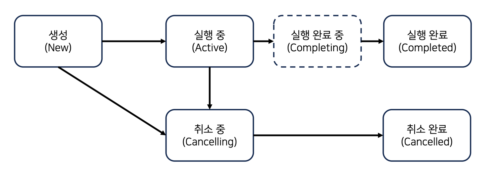

## 섹션 2
### 스레드 기반 작업의 한계와 코루틴의 등장

### 단일 스레드 애플리케이션의 한계와 멀티 스레드 프로그래밍
- 스레드 하나만 사용해 실행하는 애플리케이션
- 한번에 하나의 작업 밖에 수행 못함

### 스레드, 스레드 풀을 사용한 멀티 스레드 프로그래밍 
- Thread 클래스를 직접 사용한 멀티 스레드 프로그래밍의 한계
  - Thread 의 start 함수를 호출할 때 마다 새로운 스레드가 생성되고 재사용이 어려움
- 개발자가 스레드 생성과 관리에 대해 책임을 가진다.
  - 개발자의 실수나 오류로 인해 메모리 누수가 발생할 수 있음
  - 프로그램이 복잡해질 수록 스레드의 생성과 관리를 직접 하는게 매우 어려움
- Executor 프레임웍
  - 스레드의 집합인 스레드풀을 미리 생성하고, 작업을 요청 받으면 쉬고 있는 스레드에 작업을 분배할 수 있는 시스템
- CompletableFuture
  - 콜백 지옥 발생
### 스레드 기반 작업을 사용하는 방식의 한계와 코루틴의 등장
- 코루틴이라는 작업 단위
- 코루틴은 스레드와 달리 실행 중에 중단하고 다시 시작할 수 있는 있음
- 경량 스레드

### 코루틴 디버깅
- -Dkotlinx.coroutines.debug 
  - 코루틴 디버깅을 활성화하는 JVM 옵션

## 섹션 3

### CoroutineDispatcher
- 디스패처는 보내는 주체 따라서 코루틴 디스패처는 코루틴을 쓰레드로 보내 실행시키는 주체

### CoroutineDispatcher 종류
- Dispatchers.IO
  - 네트워크나 DB 작업 같은 입출력(I/O) 작업을 실행하는 디스패처 
  - 약 64개 스레드
  - **limitedParallelism** 함수를 사용하면 **공유 스레드풀의 별도 스레드 중 일부를 사용**하는 CoroutineDispatcher를 반환
- Dispatchers.Default
  - CPU 바운드 작업을 위한 디스패처
    - 이미지, 동영상 처리나 대용량 데이터 변환 같은 끊이지 않고 연산이 필요한 작업
  - **limitedParallelism** 함수를 사용하면 **Dispatcher.Default 스레드 중 일부를 사용**하는 CoroutineDispatcher를 반환
- Dispatchers.Main
  - main 스레드에서의 작업을 위한 디스패처
  - 기본 코루틴 라이브러리에는 구현체가 없다 (안드로이드 라이브러리 필요)
  - Dispatchers.Main.immediate
    - main 스레드에서 실행되는 코루틴을 즉시 실행할 수 있는 디스패처
    - 코루틴을 요청하는 스레드가 메인 스레드일 경우 작업 대기열에 적재되지 않고 바로 메인 스레드에서 실행
      - 안드로이드 UI 에 바로 반영이 되어 메인 디스패처 사용 시 권장됨

[//]: # (    - main 스레드가 아닌 다른 스레드에서 호출하면, main 스레드가 준비될 때까지 대기)

## 섹션 4
### 코루틴 Job 순차 처리
- join, joinAll 함수를 활용하여 작업이 끝날 때 까지 대기 

### 지연 코루틴 (Lazy Coroutine)
- dispatcher 에 CoroutineStart.LAZY 인자를 주면 지연 코루틴이 생성됨
- 코루틴이 시작되기 전까지는 아무 작업도 수행하지 않음
- start 함수 호출 시 코루틴이 시작됨
  - join 함수 호출 시에도 코루틴이 시작되지만 runBlocking 함수를 일시 중단한다
  - start 함수는 runBlocking 함수를 일시 중단하지 않고 다른 작업을 바로 할 수 있다
- 코루틴이 시작되기 전까지는 코루틴의 상태가 CREATED 상태

### 코루틴 취소
- 코루틴 실행도중 취소하지 않으면 스레드를 계속 사용하기 때문에 어플리케이션 성능 저하를 유발할 수 있다
- cancel 함수의 문제
  - 코루틴을 즉시 취소하지 않고, 취소 플래그를 '취소 요청됨' 으로 바꾸는 역할만 함
  - 이후 플래그가 확인되는 시점에 코루틴이 취소됨
  - 즉 순차 진행이 필요한 곳에서 사용시 문제가 될 수 있음
- cancelAndJoin 함수
  - cancel 함수와 join 함수를 합친 함수
  - 취소 요청 후 취소가 완료될때 까지 코루틴 호출 일시 중단
  - 코루틴 블럭 내에서 Thread.sleep 같은 **블로킹 작업을 사용하면 취소가 되지 않음**
    - 코루틴 블록이 끝나는 지점에 가서 중단이됨
    - 즉시 중단하고 싶으면 코루틴 블럭 내에서 Thread.sleep 대신 **delay** 함수를 사용해야 함

### 코루틴 취소 확인
- 코루틴 취소 확인 시점
  - 일시 중단 시점
  - 코루틴이 실행을 대기 하는 시점
- 코루틴 취소 확인 시점 만들기
  - delay 함수를 사용
  - yield 함수를 사용
  - CoroutineScope.isActive 사용
- 취소 확인 시점 만들 때 주의할 점
  - delay()
    - 반복문 내에서는 delay 사용은 권장하지 않음 (불필요한 지연 발생)
      - yield 함수를 사용하면 즉시 취소확인이 된다
  - yield()
    - **delay, yield 함수 모두 코루틴을 일시중단 후 재개과정을 거친다**
      - 재개 시에는 CoroutineDispatcher에 의해 다시 스레드로 보내지는 과정을 거치기 때문에 비효율적이다
    - 코루틴이 실행을 대기하는 시점에 취소 확인을 하기 때문에, 코루틴이 실행을 대기하는 시점이 없으면 취소 확인이 되지 않음
- 코루틴을 **일시 중단 시키기 않고 취소확인**할 수 있는 방법
  - CoroutineScope.isActive
  - 코루틴에 취소 요청되면 isActive가 false로 바뀜

### 코루틴의 상태와 Job 객체의 상태 변수
- 코루틴 상태
  
  - Active
    - 코루틴이 실행 중인 상태
  - New
    - 코루틴이 생성된 상태
  - Completed
    - 코루틴이 완료된 상태
  - Cancelling
    - 코루틴이 취소 중인 상태
  - Cancelled
    - 코루틴이 취소된 상태
- 코루틴 상태를 job 객체 toString 으로 호출하는 건 좋지 않은 방법이다
  - 라이브러리 내부에서만 사용하는 거라 외부에서 사용할 수 없다
- Job 객체의 상태 변수
  - Job 객체는 코루틴을 추상화한 객체여서 코루틴 상태를 간접적으로 나타낸다
    - isActive
      - 코루틴이 실행 중인 상태
    - isCompleted
      - 코루틴이 완료된 상태
      - 코루틴이 실행 완료되거나 취소 완료된 상태
    - isCancelled
      - 코루틴에 취소가 요청됐는지 여부
      - cancel 함수가 호출되기만 하면 true 를 반환하므로, 취소 중인 상태도 포함된다

  | 코루틴 상태 | isActive | isCancelled | isCompleted |
  |--------|----------|-------------|-------------|
  | 생성     | false    | false       | false       |
  | 실행 중   | true     | false       | false       |
  | 실행 완료  | false    | false       | true        |
  | 취소 중   | false    | true        | false       |
  | 취소 완료  | false    | true        | true        |
